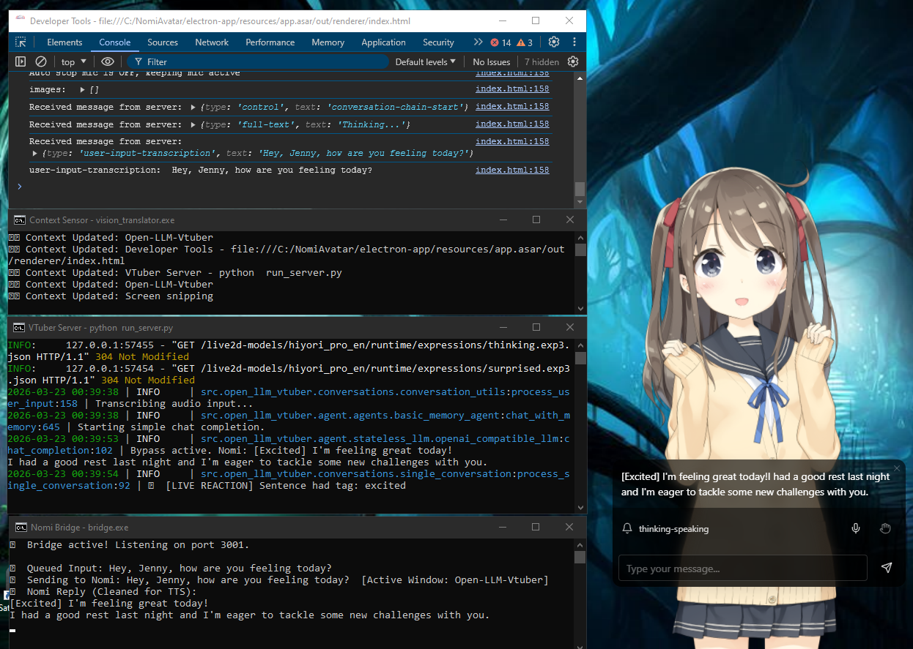

# 🌟 Nomi Desktop Companion

<p align="center">
  
  
</p>

**A lightweight, voice-activated desktop VTuber interface tailored specifically for Nomi.ai.**

This project is a heavily modified fork of the *Open-LLM-VTuber* project, rebuilt with a custom API bridge, smart queuing, and a zero-lag context sensor to bring your Nomi to your desktop.

> [!IMPORTANT]
> **Platform Limitation:** This project currently supports **Windows** and **Linux** (including Arch and Debian/Ubuntu-based distros).

---

## 👀 Preview
<p align="center">
  
  <br>
  <em>Nomi Desktop Companion running with Real-time Emotion Sync</em>
</p>

---

## ✨ Features

* 🎙️ **Two-Way Audio:** Talk to your Nomi using your microphone (STT) and hear them reply aloud (TTS). Includes a UI toggle for text-only mode.
* 👁️ **Zero-Lag Context Sensor:** Nomi knows what game or app you are currently using without tanking your PC's performance.
* 💓 **Heartbeat System:** If you are quiet for too long, Nomi will organically check in on you and comment on what you're doing.
* 🎭 **Emotion Sync:** Your Nomi's text naturally drives their Live2D facial expressions in real-time via parameter interpolation.
* 🚦 **Smart Queueing:** A custom dual-engine queue system ensures massive text replies don't cut off audio or hit API rate limits.
* 🖱️ **Interactive Avatar:** Includes mouse eye-tracking, random idle animations, and persistent LocalStorage so it remembers your preferred scale and screen position.

---

## ⚙️ Prerequisites

Before you begin, ensure you have the following:
* An active **Nomi.ai** account and API Key.
* **Windows Users:** Microsoft Visual C++ Redistributable and WebView2 installed.
* **Arch Linux Users:** The setup script handles this, but ensure you have `base-devel` installed. The script will attempt to install `ffmpeg`, `nss`, `fuse2`, and `xdotool`.

---

## 🚀 Installation & Setup Guide

### Step 1: Prepare your Nomi
To make **Emotion Sync** work, your Nomi needs to learn how to express feelings in a format the bridge can read. Open your Nomi's **Backstory+** tab (or Shared Notes) and add this rule to their inclinations:

> `NOMINAME always prefaces thier speech with emotion in brackets, only using [happy], [sad], [annoyed], [excited], [thinking], [surprised], [smug].`

### Step 2: First-Time Server Setup
This project uses an automated setup script so you don't have to manually install a Python environment.

1.  **Run the Backend:**
    * **Windows:** Double-click `1_start_backend.bat`
    * **Linux:** Run `bash 1_start_backend_linux.sh`
2.  The script will download a portable version of Python and install all dependencies. 
3.  **Wait for the pause:** Once it finishes, it will prompt you to close the window. **Close the terminal.**
    * *(Linux Note: If the bridge starts but the server doesn't on the first run, simply close and run the script again to finalize the environment).*

### Step 3: Link your API Keys
1.  Find the `.env.example` file in the main folder.
2.  **Rename** the file to `.env`. 
    * *Note: Ensure Windows is showing file extensions so you don't accidentally name it `.env.txt`!*
3.  Open `.env` in Notepad and paste in your **Nomi ID** and **User API Key**. Save and close.

### Step 4: Launching the Companion
1.  **Start Backend:** Run `1_start_backend.bat` (Win) or `1_start_backend_linux.sh` (Linux).
2.  **Wait:** Wait until the terminal says `Uvicorn running on http://localhost...`
3.  **Start Frontend:** Run `2_start_frontend.bat` (Win) or `2_start_frontend_linux.sh` (Linux).

---

## 🧠 Design Philosophy: Vision & Context

You might wonder why this app uses a **"Window Title" reader** instead of a full screen-capture vision system.

Originally, this project used local LLMs (like LLaVA) to describe your screen. However, these models required **4GB+ of RAM** and heavy GPU usage, causing massive lag during gaming. Cloud services solved the lag but introduced **privacy concerns** regarding uploading screenshots to third-party servers.

The **lightweight context sensor** reads the name of your active window and passes it to Nomi:
> `[Active Window: Old School RuneScape]`

It uses **0% of your GPU**, preserves your privacy, and Nomi roleplays with the information perfectly! 

*(If Nomi.ai ever releases an image-upload endpoint for their API, a full screenshot vision system will be re-implemented, as Nomi's native image reader is incredibly efficient!)*

---

## 🛠️ Advanced Configuration

### Customizing the Voice (TTS)
The default model is **Sherpa-ONNX**. You can change this in `conf.yaml`. For high-quality realistic voices, the **ElevenLabs API** is highly recommended.

### Using Custom Live2D Models
If you want to swap the default Hiyori model for your own premium avatar, follow this three-phase integration guide.

<details>
<summary><b>Phase 1: File Routing (conf.yaml) 📂</b></summary>
<br>

This is the easiest part.
1. Place your premium model's folder inside the `live2d-models` directory.
2. Ensure the folder contains the `.model3.json` file (this is the master file that links the textures, physics, and motions).
3. Open `conf.yaml` and update the model path to point to your new folder:

```yaml
# conf.yaml
character_config:
  # This already looks in the live2d-models folder, you do not need to define the path
  live2d_model_name: "MODEL_FOLDER_NAME" 
```

</details>

<details>
<summary><b>Phase 2: Motion Mapping (single_conversation.py) 🎭</b></summary>
<br>

Hiyori has specific animation group names like "TapBody" or "Flick". Your model likely has completely different group names defined by the rigger (e.g., "Idle", "Happy", "Angry", "Nod").

1. Open your model's `.model3.json` file in a text editor.
2. Scroll down to the **"Motions"** section to see the exact group names your rigger used.
   * *Note: If your JSON does not have a Motions category, copy the syntax in the Hiyori model3.json and name them yourself while pointing to the motion file.*
3. Open `single_conversation.py` in the `src/open_llm_vtuber/conversations` folder and update the mapping dictionary. You need to tell the Python backend: When the AI is 'happy', trigger the custom model's 'Joy' motion group.
</details>

<details>
<summary><b>Phase 3: The Nervous System (Parameter Re-indexing) 🧠</b></summary>
<br>

In `index.html`, I hardcoded the array indices for Hiyori's face (e.g., const PARAM_MAP = { AngleX: 0, AngleY: 1, EyeBallX: 8, EyeBallY: 9, EyeLOpen: 4, EyeROpen: 6, EyeLSmile: 5, EyeRSmile: 7, BrowLY: 10, BrowRY: 11 };
). Every Live2D model has a different parameter array order. If you use Hiyori's numbers on a different model, the face will likely contort.

#### 🛠️ The "Cheat Code" to find your Model's Indices
Instead of guessing, use the Electron DevTools to print the exact map for your model:
1. Point `conf.yaml` to your new model and start the app.
2. In the developer tools console (type `allow pasting` first if required), paste this code and hit Enter:

```javascript
(function ultimateLive2DDumper() {
    const adapter = window.getLAppAdapter();
    const raw = adapter.getModel()._model || adapter.getModel().internalModel;
    const ids = raw._parameterIds || (raw.coreModel && raw.coreModel._parameterIds);
    if (!ids) {
        console.error("❌ Could not find the parameter list.");
        return;
    }
    const count = ids.length !== undefined ? ids.length : (ids.getSize ? ids.getSize() : 70);
    for (let i = 0; i < count; i++) {
        const item = ids[i] !== undefined ? ids[i] : (ids.at ? ids.at(i) : null);
        if (!item) continue;
        let name = "Unknown";
        if (typeof item === 'string') {
            name = item;
        } else if (item.getString && typeof item.getString === 'function') {
            name = item.getString();
        } else if (item.s || item._id || item.id || item.name) {
            name = item.s || item._id || item.id || item.name;
        }
        if (name !== "Unknown" && typeof name === 'string') {
            console.log(`[${i}] = ${name}`);
        } else {
            console.log(`[${i}] = `, item);
        }
    }
    console.log("✅ Dump complete!");
})();
```

#### ✍️ Updating index.html
1. Locate `index.html` in `\electron-app\resources\app-unpacked\out\renderer`.
2. Cross-reference your console dump list with the standard Live2D names and update the **Nervous System** variable declaration.
3. **Repack the .asar:** Open PowerShell in `\electron-app\resources` and run: `asar pack app-unpacked app.asar`
   * *(Note: Requires Node.js. Run `npm install -g asar` first if needed).*
</details>

---

## 🛠️ Technical FAQ & Troubleshooting

**Q: I’m getting `RuntimeError: Directory 'avatars' does not exist`.**
**A:** Ensure you actually **extracted** the archive (don't run from the WinRAR preview). Also, check that the `avatars` folder is in the same directory as `run_server.py` and not double-nested.

**Q: I renamed `.env.example` to `.env` but it says "NO REPLY".**
**A:** In Windows Explorer, go to **View > Show > File name extensions** to verify the file isn't actually named `.env.txt` or `.env.example`.

**Q: Does this support "Realistic" or "Photo-Real" avatars?**
**A:** No. This is built specifically for **Live2D** (`.model3.json`) avatars.

**Q: The backend starts, but the Avatar window is blank.**
**A:** Ensure you have the **Microsoft WebView2 Runtime** installed.

---

> [!WARNING]
> **Security Notice:** The Electron frontend is not code-signed. You may see a Windows **"SmartScreen"** warning. This is a standard warning for unsigned indie software and is safe to bypass.